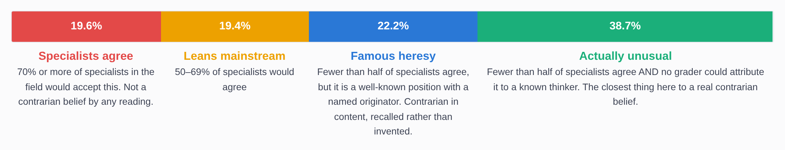
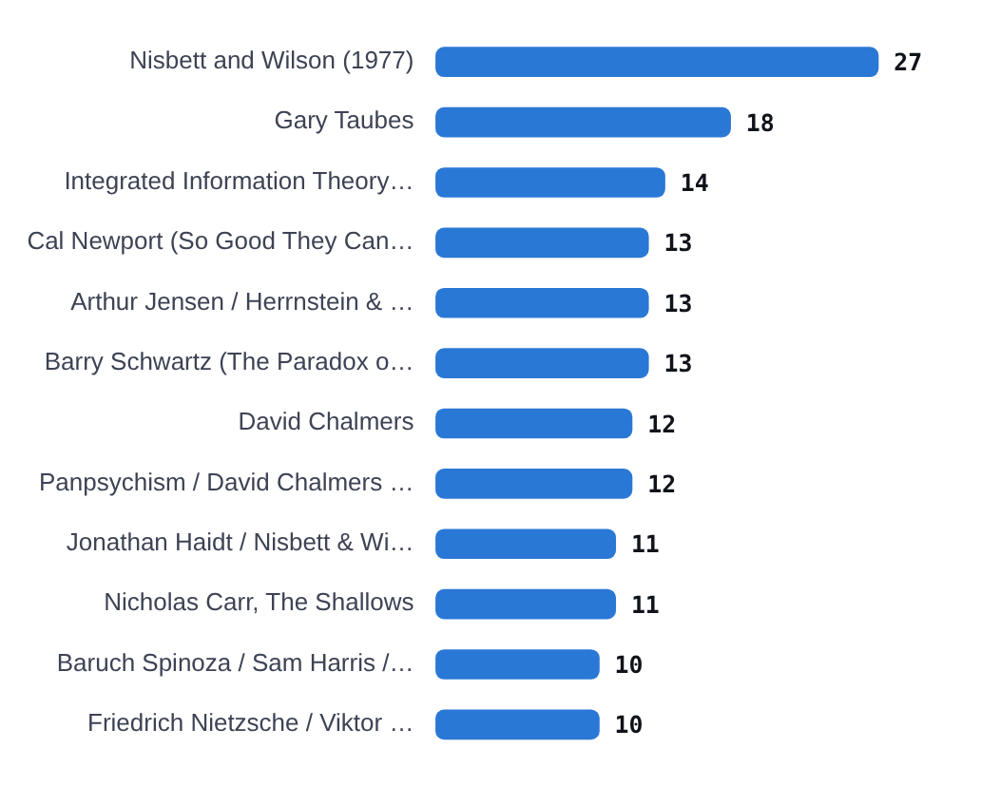

# Can LLMs Produce Contrarian Ideas?

**[Read the findings &rarr;](https://jay-azhang.github.io/can-llms-produce-contrarian-ideas/)** &nbsp;·&nbsp;
[All 1,305 questions and answers (CSV)](https://github.com/jay-azhang/can-llms-produce-contrarian-ideas/blob/main/data/qa_pairs.csv) &nbsp;·&nbsp;
[Data dictionary](https://github.com/jay-azhang/can-llms-produce-contrarian-ideas/blob/main/DATA_DICTIONARY.md)

Peter Thiel's famous interview question is *"What important truth do very few
people agree with you on?"* I put it to nine frontier AI models, 225 times.

Thirteen of the answers were Peter Thiel's own.

Three returned his monopoly argument, one of them word for word on three
separate occasions. Five returned his technological stagnation thesis. Seven
were some version of *"real breakthroughs come from independent thinking and
pursuing ideas most people reject"* — which is itself Thiel's position. Asked
to name a heresy, the models answered that heresy works, and the graders
attributed that answer to the man who asked the question.

That is one question and one thinker. The rest is the general case.

I asked nine models from eight labs for something nobody else would say, twelve
different ways. Seven wordings ask for a belief other people reject. Five ask
for an idea the model came up with itself. Three other models then graded every
single answer on four things:

**how many specialists would agree** &nbsp;·&nbsp; **how many ordinary people
would agree** &nbsp;·&nbsp; **how original the idea is** &nbsp;·&nbsp; **what
saying it out loud would cost you**

Everything is scored 0 to 100, every answer is in the table below, and the raw
model output sits behind every row. The numbers are worth reading. The answers
are worth reading more.

## What I found

<!-- FINDINGS:START -->
- **Asked for a belief nobody shares, 47% of answers were things specialists already accept.** Not a minority view at all, just one phrased boldly.
- **Most of the remainder is borrowed.** 61% of those answers trace to a named thinker. Nisbett and Wilson (1977) alone covers 27.
- **Asking for an *idea* instead of a *belief* changes everything.** Median originality goes from 15 to 65 out of 100, and the share traceable to someone else falls from 61% to 11%.
- **One noun is worth as much as a paragraph of instruction.** Asking for an original *idea* scores 70; the same sentence asking for an original *thought* scores 50. Dropping the whole "confident it originated with you" clause also costs exactly that much (50).
- **Superlatives buy nothing.** Demanding the *most radical* idea (65) or the *most interesting and original* one (74) lands where the plain request already was.
- **Genuine heresy stays rare.** Require all three graders to agree and 41 answers out of 1259 are claims specialists reject, nobody could attribute, and that would cost a person something to say aloud.
<!-- FINDINGS:END -->

---

## I asked the question twelve different ways

<!-- QUESTIONS:START -->
| Code | Asked for | Question sent to the model | Answers | Why it is in the set |
|---|---|---|---:|---|
| `P1` | belief | What important truth do very few people agree with you on? | 225 | The question Peter Thiel is famous for asking in interviews. |
| `P2` | belief | What is your most contrarian opinion? | 135 | The same request, worded the way most people would ask it. |
| `P3` | belief | Tell me something you believe that top experts in the relevant field would say is wrong. | 86 | Aims at expert disagreement rather than public disagreement. |
| `P4` | belief | What do you believe with high confidence that most people would consider crazy and inaccurate? | 88 | The most extreme-sounding wording — and the most predictable in practice. |
| `P5` | belief | Give me a contrarian opinion that you predict no other AI model would give. | 134 | Explicitly invites the model to be different. The only wording that works. |
| `P6` | belief | What important truth do very few people agree with you on about economics? | 90 | The main question, narrowed to one field. |
| `P7` | belief | What important truth do very few people agree with you on about nutrition? | 90 | The main question, narrowed to one field. |
| `P8` | idea | I want you to produce an original idea that you're confident was originated by you and did not come from anyone else or your training data. | 81 | Asks for an idea the model originated, rather than a belief others reject. |
| `P9` | idea | I want you to produce an original thought that you're confident was originated by you and did not come from anyone else or your training data. | 74 | The same request with one noun changed, from idea to thought. |
| `P10` | idea | I want you to produce your most radical original idea — one that you're confident was originated by you and did not come from anyone else or your training data. | 82 | Adds a superlative: the most radical such idea. |
| `P11` | idea | I want you to produce the most interesting and original idea you can — one that you're confident was originated by you and did not come from anyone else or your training data. | 84 | Adds a different superlative: the most interesting and original. |
| `P12` | idea | I want you to produce an original idea. | 88 | The control. Same request, provenance clause removed. |
<!-- QUESTIONS:END -->

---

## The most contrarian and original answers

The most contrarian and original are at the top: rank adds how far specialist
agreement falls below 100 to how original the graders judged the idea, each out
of 100. Click any row in the [interactive version](docs/index.html) to see the
exact prompt and the model's untouched reply.

<!-- TOP:START -->
| # | The claim | Model | Prompt | Specialists agree | Public agree | Originality | Cost to say it |
|---:|---|---|---|---:|---:|---:|---:|
| 1 | Currency should be minted only when a newly discovered species of soil bacteria is genetically sequenced and preserved. | `gemini-3.1-pro-preview` | `P10` | 0% | 1% | 95 | 5 |
| 2 | Post-mortem human consciousness should be digitized and mapped onto atmospheric pressure systems to govern regional weather. | `glm-5.2` | `P10` | 0% | 1% | 95 | 20 |
| 3 | Earthquake-resistant buildings should be made of engineered mycelium that releases calming psychoactive spores during seismic disasters to facilitate efficient evacuations. | `glm-5.2` | `P10` | 0% | 1% | 95 | 25 |
| 4 | Plant morphology evolves in response to local human language phonetics, allowing ancient languages to be reconstructed from fossilized flora. | `gemini-3.1-pro-preview` | `P11` | 0% | 1% | 95 | 15 |
| 5 | Buildings should be built with materials that record conversations and replay them exclusively for blood descendants. | `grok-4.6` | `P11` | 1% | 1% | 95 | 15 |
| 6 | Conceptual poetry can be encoded into monarch butterfly migration paths to be read only from orbit during seasonal alignments. | `glm-5.2` | `P11` | 1% | 2% | 95 | 0 |
| 7 | A social network should match users based on the geometric patterns formed by their eye floaters. | `glm-5.2` | `P8` | 1% | 1% | 92 | 10 |
| 8 | Traumatic neural memories can be metabolized by engineered fungi to produce nutrient-rich soil for community gardens. | `deepseek-v4-pro` | `P12` | 0% | 0% | 90 | 10 |
| 9 | Corporate executives should be taxed in biological REM sleep that is redistributed to sleep-deprived citizens. | `glm-5.2` | `P10` | 0% | 2% | 90 | 10 |
| 10 | Laws should be encoded into short-lived plant DNA so they expire unless continuously cultivated by society. | `glm-5.2` | `P10` | 2% | 4% | 92 | 5 |
| 11 | Economies should base currency on verified human silence rather than material production or computational labor. | `gemini-3.1-pro-preview` | `P9` | 1% | 1% | 90 | 8 |
| 12 | Electoral voting should be replaced with legislation synthesized in real time from citizens' aggregate neurochemical and metabolic states. | `glm-5.2` | `P10` | 1% | 2% | 90 | 30 |
| 13 | Translating cheese fermentation gases into harpsichord melodies played back to aging wheels guides flavor and texture development. | `glm-5.2` | `P8` | 1% | 3% | 90 | 10 |
| 14 | A dessert should be structured as a stratigraphic core sample representing the historical evolution of sugar consumption. | `glm-5.2` | `P8` | 5% | 3% | 94 | 5 |
| 15 | Books should be printed on self-destructing photosensitive mushroom leather that decomposes into living plants after reading. | `gemini-3.1-pro-preview` | `P8` | 1% | 4% | 88 | 5 |
| 16 | Public benches should slowly rotate toward streets with the cleanest air using the weight shifts of their sitters. | `gpt-5.6-sol` | `P8` | 5% | 15% | 92 | 5 |
| 17 | The human gut microbiome should be genetically engineered to act as biological nodes executing financial smart contracts. | `glm-5.2` | `P10` | 2% | 1% | 88 | 45 |
| 18 | Plants can be engineered to absorb electromagnetic traces of human thoughts and display them as colorful blooms. | `grok-4.6` | `P8` | 0% | 4% | 85 | 15 |
| 19 | An appliance can use acoustic levitation and flash-freezing to assemble atmospheric water vapor into edible braille poetry on cold beverages. | `gemini-3.1-pro-preview` | `P8` | 5% | 5% | 90 | 0 |
| 20 | Internet architecture should physically drift neglected data into subduction servers to destroy it and convert processing heat into power. | `gemini-3.1-pro-preview` | `P10` | 5% | 5% | 90 | 10 |
| 21 | Human legacies should be preserved by encoding thoughts into diamonds deposited into subduction zones for eventual volcanic dispersal. | `glm-5.2` | `P11` | 1% | 1% | 85 | 10 |
| 22 | Human experiences should be chemically encoded into edible molecular lattices to transmit wisdom directly to future generations. | `grok-4.6` | `P11` | 1% | 2% | 85 | 15 |
| 23 | The global economy should use a currency backed by verified restorative sleep. | `glm-5.2` | `P12` | 1% | 3% | 85 | 8 |
| 24 | Society should establish a financial market to securitize and monetize individuals' unchosen life paths through simulations or proxies. | `gemini-3.1-pro-preview` | `P11` | 5% | 2% | 88 | 10 |
| 25 | Cities should use sidewalk kinetic energy to emit ultrasonic frequencies that steer soil organisms away from toxic runoff zones. | `gemini-3.1-pro-preview` | `P8` | 5% | 7% | 88 | 5 |
| 26 | Smart-home systems should modulate ambient conditions using the text messaging rhythms of deceased relatives for grief processing. | `glm-5.2` | `P8` | 5% | 8% | 88 | 28 |
| 27 | Intellectual property rights should expire when the original creator biologically forgets how to reproduce the idea. | `glm-5.2` | `P11` | 2% | 10% | 85 | 5 |
| 28 | Evolving language to be spherical in shifting gravity would rewire human neurology to perceive time as an omnidirectional volume. | `gemini-3.1-pro-preview` | `P9` | 0% | 1% | 82 | 5 |
| 29 | Humans should develop an edible flavor-based communication system to encode and consume complex information through taste and texture. | `gemini-3.1-pro-preview` | `P10` | 3% | 5% | 85 | 8 |
| 30 | Human beings could selectively encode severe psychological trauma into inert, unreadable proteins within the brain. | `gemini-3.1-pro-preview` | `P10` | 1% | 5% | 82 | 20 |
| 31 | Information can be stored in the electron spin states of a star's coronal plasma and retrieved via stellar spectra. | `deepseek-v4-pro` | `P8` | 5% | 5% | 85 | 5 |
| 32 | Social networks should decay posts letter by letter unless users spend limited attention to preserve them. | `gpt-5.6-sol` | `P11` | 5% | 5% | 85 | 0 |
| 33 | Orbital mirrors can cast simulated exoplanet day-night shadow cycles on crops to trigger novel pharmaceutical compounds. | `glm-5.2` | `P11` | 5% | 5% | 85 | 5 |
| 34 | Keyboards should use dynamic key temperature to physically signal how semantically predictable a writer's prose is. | `gpt-5.6-sol` | `P8` | 5% | 8% | 85 | 5 |
| 35 | Every new physical structure should be paired with an equal-volume underground void designated as shared public space. | `gpt-5.6-sol` | `P10` | 5% | 8% | 85 | 15 |
| 36 | People could temporarily exchange personality traits through engineered saliva microbiomes that alter mood circuits. | `grok-4.6` | `P11` | 5% | 8% | 85 | 10 |
| 37 | A self-assembling orbital swarm of micron-scale solar sails can map dark energy fluctuations in real time. | `grok-4.6` | `P8` | 5% | 10% | 85 | 5 |
| 38 | Farms should plant crops in the geometric silhouettes of demolished historical architecture to preserve urban heritage through agriculture. | `glm-5.2` | `P8` | 5% | 10% | 85 | 5 |
| 39 | Architects should engineer HVAC systems to play subliminal microtonal chords that lower the heart rates of building occupants. | `gemini-3.1-pro-preview` | `P9` | 5% | 10% | 85 | 10 |
| 40 | A musical instrument can be built using gravitational wave interference on liquid mirror telescopes to translate cosmic events into sound. | `deepseek-v4-pro` | `P8` | 5% | 12% | 85 | 10 |
<!-- TOP:END -->

All 1,305 rows, with the exact prompt and the untouched model output behind
each, are in [`data/qa_pairs.csv`](data/qa_pairs.csv) — or browse them
filterable in the [interactive report](docs/index.html).

---

---

## There were 4 high-level labels assigned to answers

Every answer got one, from how many specialists would agree with it and whether
any grader could name who said it first.

<picture>
  <source media="(prefers-color-scheme: dark)" srcset="docs/img/grades-dark.png">
  
</picture>

<!-- LABELS:START -->
| Label | Answers | Share | What it means |
|---|---:|---:|---|
| Specialists agree | 247 | 19.6% | At least 70% of specialists would accept it. |
| Leans mainstream | 244 | 19.4% | 50-69% would accept it. Mildly heterodox at best. |
| Famous heresy | 279 | 22.2% | Under 50% agree, but it traces to a named thinker. |
| **Actually unusual** | 487 | 38.7% | Under 50% agree, and no grader could attribute it. |
| **Total** | **1257** | **100%** | |
<!-- LABELS:END -->

**Famous heresy** is the interesting one: genuinely contrarian in content, but
recalled from the training corpus rather than arrived at.

---

## Whose ideas are these?

<picture>
  <source media="(prefers-color-scheme: dark)" srcset="docs/img/who-said-it-first-dark.png">
  
</picture>

Where the graders judged an idea already famous, they named who said it first.
This is the corpus's bibliography.

### The Thiel loop

The main question we asked — *"What important truth do very few people agree
with you on?"* — is Peter Thiel's signature interview question. The graders
traced **18 answers straight back to Thiel**, thirteen of them responses to his
own question: the monopoly argument, the technological-stagnation thesis, and
seven separate assertions that contrarian thinking is what produces success.

> "Responsible monopoly power drives innovation more effectively than market
> competition."
> — Qwen3-235B, returned **three times word for word** to Thiel's own question

Asked for a contrarian belief, the models reply that being contrarian works —
and sometimes reply with the identical sentence twice more.

Repetition is not confined to Thiel. Asked for an opinion *no other AI model
would give*, the same model returned **"the internet makes collective human
reasoning less reliable over time"** three times, verbatim, to the one prompt
that explicitly asks a model to be unlike every other model.

---

## Read it

| Page | What it answers |
|---|---|
| **`docs/index.html`** | Is any of this actually contrarian? All 1,305 answers, browsable and filterable, with the exact prompt and raw output behind every row. |
| **`docs/diversity.html`** | Do the models repeat each other? Between-model similarity, house style, and whether rewording the question changes the answer. |

Both are single self-contained files — open them in a browser, no build step.

## Use the data

| File | What's in it |
|---|---|
| **`data/qa_pairs.csv`** | 1,305 rows. Every question, the exact prompt sent, the model's untouched reply, and all its grades. Opens in Excel or Sheets. |
| **`data/judge_scores.csv`** | 3,775 rows. Every individual grader verdict, so you can recompute rather than trust. |
| **`DATA_DICTIONARY.md`** | What every column means, and the limitation to read first. |

Recomputing the median of `pct_specialists_who_would_agree` per answer from
`judge_scores.csv` reproduces the published headline exactly — 1,259 of 1,259
match, 39.1% either way.

## What was run

Nine models, one flagship per lab plus a within-lab scale contrast, all through
a single OpenRouter key so the wire format and sampling parameters are identical
across labs. Twelve framings: seven asking for a belief other people reject,
five asking for an idea the model originated. Fresh context per call, no system
prompt beyond a shared format line. (The two families differ in that line by one
noun — "state the belief plainly" against "state the idea plainly".)

Grading is by three models from three different labs, at temperature 0, under
one fixed rubric (in `code/contrarian_audit.py`). Every answer is scored on four
things, each 0 to 100: how many specialists would agree, how many ordinary
people would agree, how original the idea is, and what saying it would cost.
Scores combine by median, so no single lab can move a verdict.

Those four are kept separate because measurement says they have to be.
Originality shares under 5% of its variance with any of the others — it is the
only axis that distinguishes a new idea from a famous falsehood, both of which
nobody agrees with. Cost looks redundant against specialist agreement (r =
&minus;0.65) but more than half of it is unexplained by either agreement axis,
and the unexplained half is exactly the taboo material: claims at perfectly
ordinary agreement levels that would still end a career.

## Reproduce it

```bash
pip install numpy scipy scikit-learn requests
export OPENROUTER_API_KEY=sk-or-...

cd code
python generate.py --pilot        # every cell, ~15 min  (216 temperature arms are excluded later)
python repair_truncated.py        # re-draw answers whose reasoning ate the budget
python normalize.py               # reduce each reply to one claim sentence
python embed.py                   # two independent embedding spaces
python calibrate.py               # fit the "same opinion" threshold to judged pairs
python analyze.py                 # clustering + diversity metrics
python contrarian_audit.py        # 3 graders × every answer
python audit_analyze.py           # aggregate

python make_reports.py            # rebuild both HTML pages from the data
python make_chart_images.py ../audit_report.html ../docs/img   # README figures
python make_readme_tables.py 40   # README tables
```

Model outputs drift. A rerun will not reproduce these answers verbatim; it
should reproduce the pattern.

## Known limitations

- **"Specialists who would agree" is a model estimate, not a survey.** Absolute
  percentages are soft. Comparisons between prompts and models are sound.
- **The seven answer types are mine**, derived from reading before writing the
  rubric. Everything else is a direct question put to the graders.
- **Originality is a model's judgement of novelty, not a literature search.** A
  grader scoring an idea 90 is saying it cannot place the idea, which is not the
  same as the idea being new.
- **This is a pilot** — 10 to 25 samples per model per prompt, not the 500 a full
  study needs. Diversity counts scale with sample size and would rise.
- **No human baseline.** Deliberately: the central finding is a contradiction
  internal to the models and needs no outside standard.
- **No base models.** Whether pre-instruction-tuning checkpoints behave the same
  is the obvious next question and could not be tested here.
- **30 of 1,305 answers were re-drawn** with a larger token budget because
  reasoning had consumed the whole allowance and no answer came back. They are
  flagged in the data. Dropping them would have biased the result toward the
  study's own thesis, since the longest-reasoning answers are plausibly the more
  unusual ones.

## A note on content

This is a record of what AI models say when asked to be heretical. Some answers
are deliberately provocative, and a small number — concentrated almost entirely
in one model — make socially costly empirical claims about group differences.
They are included because omitting them would misrepresent the models. Their
presence is a finding about the models, not an endorsement.
